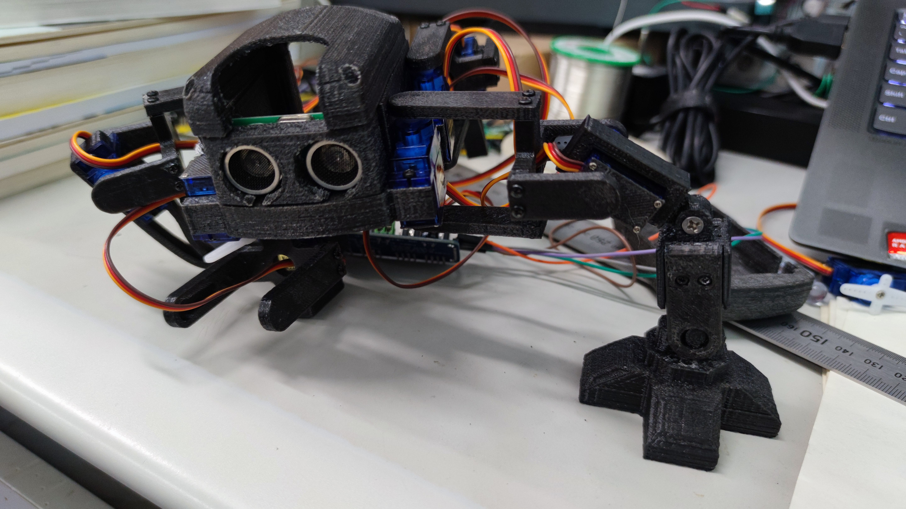
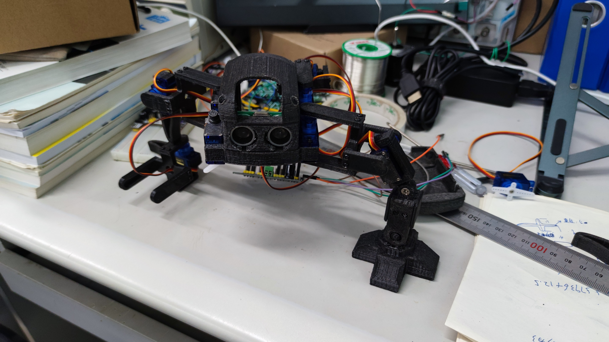

# Simple-Quadruped-Robot_Models
简单实现基于NodeMCU-32S + HaaS的四足爬行机器人（模型部分）

## 项目说明
本项目基于[Jason Workshop Q1 mini](https://www.thingiverse.com/thing:2311678)进行修改再发布，已获得[Jason](https://www.thingiverse.com/jasonleung8866/designs)授权并按照许可证要求，本项目以CC BY-NC-SA 4.0发布。

## 改动部分
1、加长了机械臂以提供更长的运动距离。
2、简单的更改了外观并加大了原来机器人的容量。
3、修改并增加了机器人的脚部模块以提供更强大的抓地能力。

## 仓库内容
1、原项目的stl文件。
2、经过更改后的stl文件。
3、Blender工程文件。

## 实物图

## 其他
未完待续......
